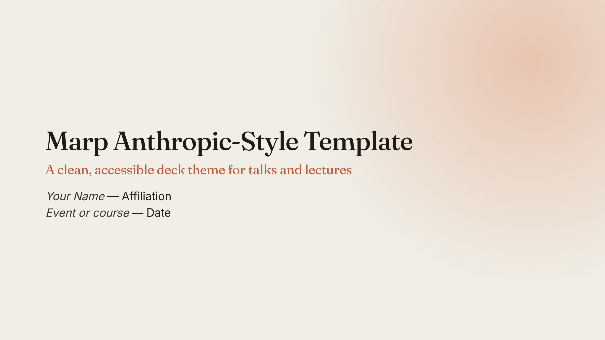
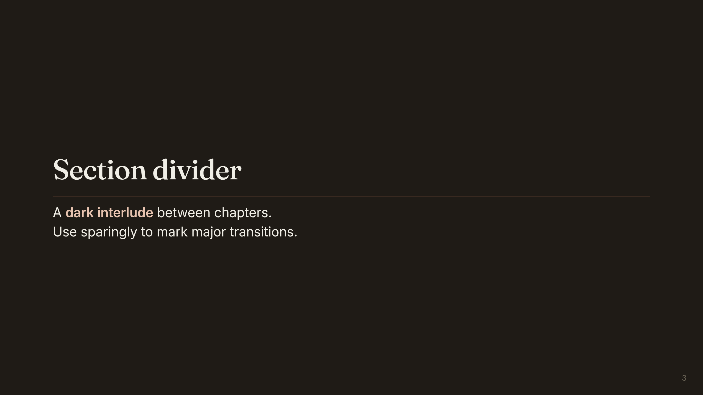
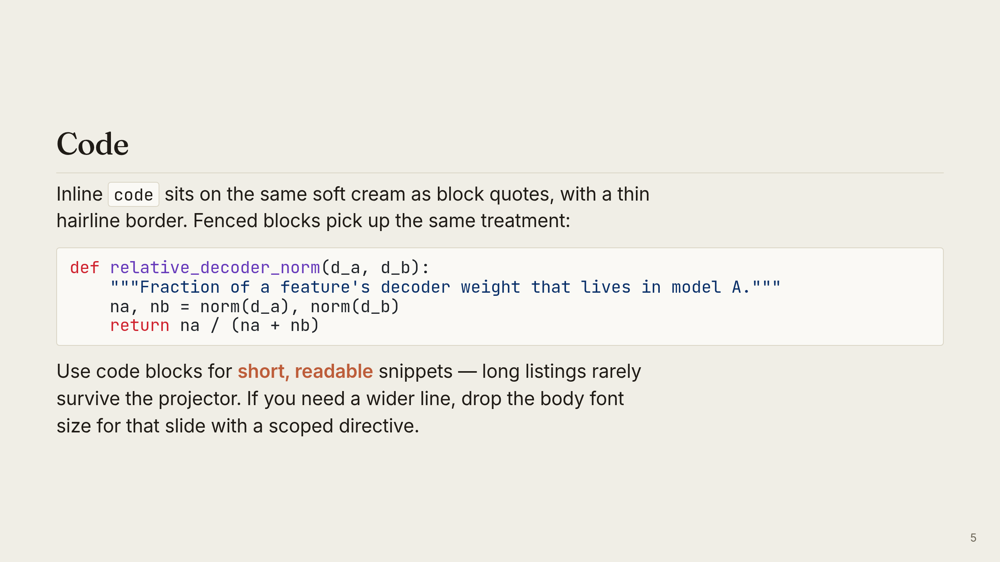
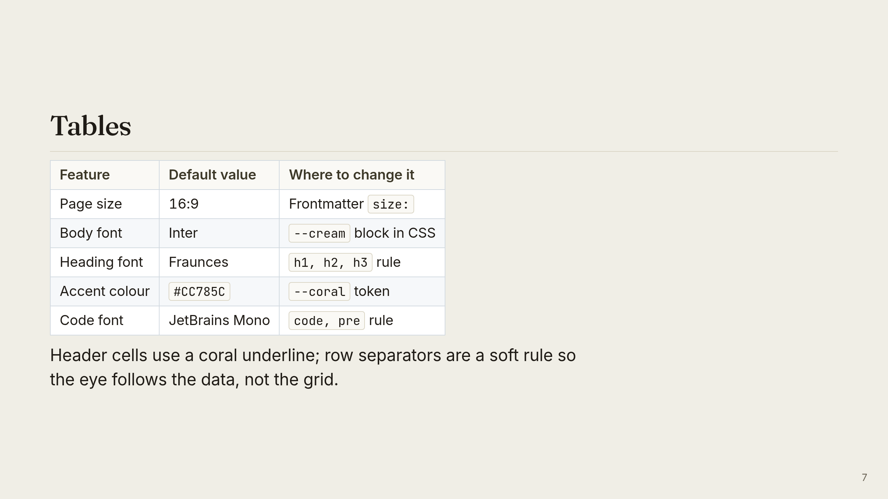

# Marp Anthropic-Style Template

A [Marp](https://marp.app) deck theme in the cream-and-coral style of
Anthropic's public materials. One markdown file, theme in the
frontmatter, no build pipeline.



## Quickstart

```bash
git clone https://github.com/federicotorrielli/marp-anthropic-template.git my-talk
cd my-talk
# edit slides.md
marp slides.md --pdf            # → slides.pdf
```

Replace the example slides in `slides.md` with your content and run
`marp`. Every styled element (lists, tables, code, blockquotes, math,
figures, utility classes) is demonstrated there.

## Prerequisites

- **Marp CLI** — `npm install -g @marp-team/marp-cli`. See [other
  install options](https://github.com/marp-team/marp-cli#install).
- **VS Code** — the [Marp for VS
  Code](https://marketplace.visualstudio.com/items?itemName=marp-team.marp-vscode)
  extension gives a live preview and command-palette exports.

PDF and PPTX export need a Chromium-based browser, picked up
automatically on most platforms.

## Project layout

```
.
├── slides.md          # the deck and the theme — edit this
├── assets/
│   ├── placeholder.svg    # example figure used by slides.md
│   └── preview-*.png      # README screenshots
├── README.md
├── LICENSE            # EUPL-1.2
└── .gitignore         # excludes built HTML/PDF/PPTX output
```

## Building

| Command                       | Output                       |
|-------------------------------|------------------------------|
| `marp slides.md`              | `slides.html`                |
| `marp slides.md --pdf`        | `slides.pdf`                 |
| `marp slides.md --pptx`       | `slides.pptx` (editable)     |
| `marp slides.md --images png` | One PNG per slide            |
| `marp slides.md --server`     | Live preview at `localhost:8080` |

Add `--allow-local-files` for PDF/PPTX export when slides reference
local images under `assets/`.

## Customisation

### Colour palette

CSS custom properties at the top of the `<style>` block in `slides.md`.
Change one variable and every slide follows.

| Token            | Default     | Used for                              |
|------------------|-------------|---------------------------------------|
| `--cream`        | `#F0EEE6`   | Slide background                      |
| `--cream-soft`   | `#FAF9F5`   | Code blocks, blockquote, table head   |
| `--ink`          | `#1F1B16`   | Body text                             |
| `--ink-soft`     | `#3D3929`   | `h2`, secondary text, blockquote text |
| `--muted`        | `#6B6557`   | Captions, page numbers                |
| `--rule`         | `#DAD5C5`   | Hairline borders, table rows          |
| `--coral`        | `#CC785C`   | List markers, quote rule, table accent|
| `--coral-deep`   | `#BD5D3A`   | Links, `h3`, `strong`                 |
| `--coral-soft`   | `#E8C4B0`   | Title-slide glow, divider highlight   |

### Typography

Three Google Fonts imported at the top of the style block: **Fraunces**
(headings), **Inter** (body), **JetBrains Mono** (code). Swap any by
editing the `@import` URL and matching `font-family`. Fallbacks
(`Georgia`, `system-ui`, `ui-monospace`) keep the deck readable offline.

### Slide classes

```markdown
<!-- _class: title -->
<!-- _paginate: false -->

# Title slide
## Subtitle
```

```markdown
<!-- _class: divider -->

# Section heading
```

Add your own with a `section.<name> { … }` rule in the style block.

### Utility classes

- `<span class="small">` — 18 px muted text for asides and footnotes.
- `<span class="cite">` — 16 px italic muted text for citations.
- `<p class="small">…</p>` under a figure for a caption.

### Math

KaTeX is enabled by default. Set `math: mathjax` in the frontmatter to
switch.

## Accessibility

- **Contrast.** Default ink-on-cream (`#1F1B16` on `#F0EEE6`) clears
  WCAG AAA; coral accents (`#BD5D3A` on `#F0EEE6`) clear AA at the
  default 24 px body size and every heading size. Re-check with
  [WebAIM](https://webaim.org/resources/contrastchecker/) if you change
  colours.
- **Type scale.** Body 24 px, headings 22–56 px. Keep body text ≥ 20 px.
- **Alt text.** Write meaningful alt text for every figure; the theme
  cannot do it for you.
- **Heading hierarchy.** `h1`/`h2`/`h3` are styled distinctly — use them
  in order, don't skip levels.
- **Page numbers.** `paginate: true` on by default.
- **Screen readers.** For audiences that may include screen-reader
  users, export to HTML and test with VoiceOver, NVDA, or Orca. Caption
  and transcribe any embedded media.

## Gallery

| Section divider | Code slide | Tables |
|---|---|---|
|  |  |  |

## Credits

- Theme inspiration: the typography and palette of Anthropic's public
  materials. **Not affiliated with, endorsed by, or sponsored by
  Anthropic PBC.** "Claude" and "Anthropic" are trademarks of Anthropic
  PBC.
- Built on [Marp](https://marp.app) and [Marpit](https://marpit.marp.app).
- Fonts: [Fraunces](https://fonts.google.com/specimen/Fraunces),
  [Inter](https://fonts.google.com/specimen/Inter),
  [JetBrains Mono](https://fonts.google.com/specimen/JetBrains+Mono) —
  SIL Open Font License.

## License

[European Union Public Licence v1.2](https://eupl.eu/1.2/en/) (see
[`LICENSE`](LICENSE)), a copyleft licence compatible with GPL, LGPL,
MPL, and others. Slides you write *using* the template are your own work
and not covered by the EUPL.
