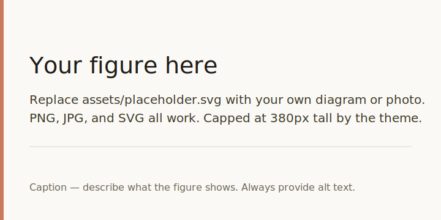

<!-- _class: title -->
<!-- _paginate: false -->

# Marp Anthropic-Style Template

## A clean, accessible deck theme for talks and lectures

*Your Name* — Affiliation
*Event or course* — Date

---

# About this template

This is a **Marp** deck themed in the style popularised by Anthropic's
public materials: a warm cream canvas, ink-dark body text, and coral
accents on a *Fraunces* + *Inter* typographic pairing.

Edit `slides.md` and run `marp slides.md` (or use the VS Code extension)
to produce HTML, PDF, or PowerPoint output. Everything you need is in
this one file — the CSS lives in the frontmatter so the deck travels
on its own.

See the [Marp documentation](https://marpit.marp.app/) for the full
syntax reference.

---

<!-- _class: divider -->

# Section divider

A **dark interlude** between chapters.
Use sparingly to mark major transitions.

---

# Lists and quotations

Bullet lists use coral markers:

* First idea, kept short and concrete.
* Second idea, written so it stands on its own.
* Third idea, with a *gentle* emphasis where it helps.

Numbered lists work the same way:

1. Set up the problem.
2. Describe the approach.
3. Report the result.

> Block quotes get a coral rule and a soft cream background — useful
> for pulling out a definition, a key claim, or a line from a paper.

---

# Code

Inline `code` sits on the same soft cream as block quotes, with a thin
hairline border. Fenced blocks pick up the same treatment:

```python
def relative_decoder_norm(d_a, d_b):
    """Fraction of a feature's decoder weight that lives in model A."""
    na, nb = norm(d_a), norm(d_b)
    return na / (na + nb)
```

Use code blocks for **short, readable** snippets — long listings rarely
survive the projector. If you need a wider line, drop the body font
size for that slide with a scoped directive.

---

# Mathematics

KaTeX is enabled in the frontmatter (`math: katex`). Inline math like
$\mathcal{R}_i^A = \|\mathbf{d}_i^A\| / (\|\mathbf{d}_i^A\| + \|\mathbf{d}_i^B\|)$
flows with the prose, and display math gets its own line:

$$
\mathcal{L} \;=\; \underbrace{\|\mathbf{x}_A - \hat{\mathbf{x}}_A\|_2^2}_{\text{model A reconstruction}}
        \;+\; \underbrace{\|\mathbf{x}_B - \hat{\mathbf{x}}_B\|_2^2}_{\text{model B reconstruction}}
$$

Switch to MathJax by changing `math: katex` to `math: mathjax` if you
need extensions KaTeX does not support.

---

# Tables

| Feature           | Default value | Where to change it      |
|-------------------|---------------|-------------------------|
| Page size         | 16:9          | Frontmatter `size:`     |
| Body font         | Inter         | `--cream` block in CSS  |
| Heading font      | Fraunces      | `h1, h2, h3` rule       |
| Accent colour     | `#CC785C`     | `--coral` token         |
| Code font         | JetBrains Mono| `code, pre` rule        |

Header cells use a coral underline; row separators are a soft rule so
the eye follows the data, not the grid.

---

# Figures



<p class="small">Figures are centred and capped at 380px tall. Always
write descriptive alt text — it is read aloud by screen readers and
indexed by search.</p>

---

# Utility classes

The theme ships two small helpers you can apply with raw HTML:

* `<span class="small">` — 18px muted text, for footnotes and asides.
* `<span class="cite">` — 16px italic muted text, for source lines.

<span class="small">Use `.small` for caveats that should not compete
with the main point of the slide.</span>

<span class="cite">Smith et al., *On the Aesthetics of Slide Decks*, 2024.</span>

---

<!-- _class: title -->
<!-- _paginate: false -->

# Get started

## Fork, edit `slides.md`, present.

`marp slides.md --pdf` &nbsp;·&nbsp; `marp slides.md --html` &nbsp;·&nbsp; `marp slides.md --pptx`
